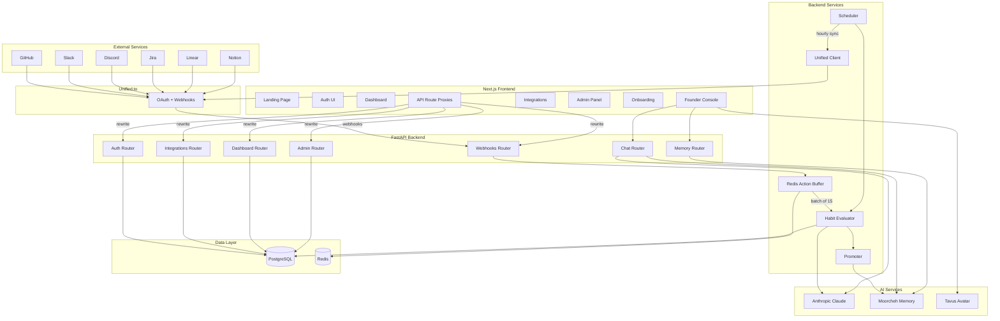
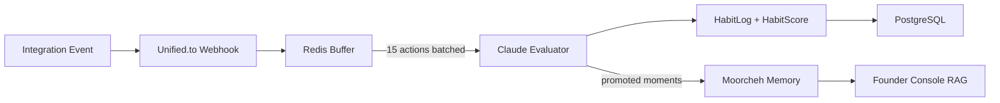
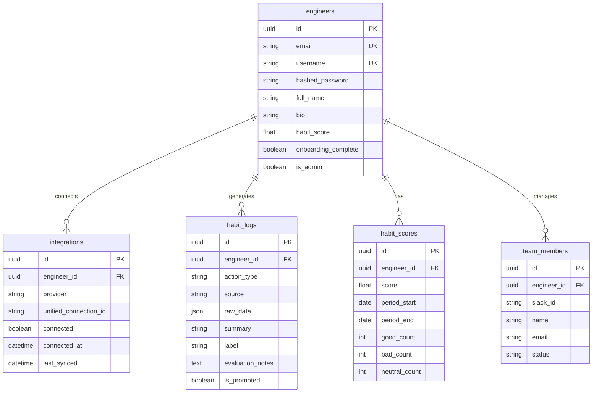

<p align="center">
  
</p>

<h1 align="center">Revenant</h1>

<p align="center">
  <strong>The AI Symbiote for Engineering Teams</strong>
</p>

<p align="center">
  Revenant captures engineering context from your tools, builds a living knowledge base, and exposes it through an interactive AI mentor — so your team never loses institutional knowledge again.
</p>

<p align="center">
  <a href="#features">Features</a> &nbsp;&bull;&nbsp;
  <a href="#architecture">Architecture</a> &nbsp;&bull;&nbsp;
  <a href="#tech-stack">Tech Stack</a> &nbsp;&bull;&nbsp;
  <a href="#getting-started">Getting Started</a> &nbsp;&bull;&nbsp;
  <a href="#project-structure">Project Structure</a> &nbsp;&bull;&nbsp;
  <a href="#api-reference">API Reference</a> &nbsp;&bull;&nbsp;
  <a href="#deployment">Deployment</a>
</p>

---

## Features

- **Integration Hub** — Connect GitHub, Slack, Discord, Jira, Linear, and Notion through Unified.to OAuth flows
- **Habit Intelligence** — Events from connected tools are buffered, batch-evaluated by Claude, and scored as good, bad, or neutral engineering habits
- **Rolling Habit Scores** — 30-day rolling scores per engineer with breakdown by category
- **Semantic Memory** — Moorcheh-powered vector store captures evaluated actions as long-term founder knowledge
- **Founder Console** — Interactive Tavus video avatar paired with Claude chat, augmented by memory retrieval and context injection
- **Dashboard** — Operator view with integration status, activity feed, habit charts, and promoted highlights
- **Admin Panel** — Manage engineers, review habit logs, and override AI evaluations
- **Onboarding Flow** — Guided setup for new engineers joining the platform

---

## Architecture



### Data Flow



---

## Tech Stack

### Frontend

| Category | Technologies |
|:---------|:-------------|
| Framework | Next.js 16, React 19 |
| Styling | Tailwind CSS 4, PostCSS |
| AI / Chat | Anthropic SDK, Vercel AI SDK, OpenAI SDK |
| 3D / Canvas | Three.js, React Three Fiber, Drei, OGL |
| Charts | Recharts, D3 |
| Animation | Framer Motion |
| UI Components | Radix UI, Lucide React |
| Utilities | Axios, clsx, tailwind-merge, class-variance-authority |

### Backend

| Category | Technologies |
|:---------|:-------------|
| Framework | FastAPI, Uvicorn |
| ORM | SQLAlchemy + asyncpg |
| Migrations | Alembic |
| Cache / Queue | Redis |
| AI | Anthropic Claude API |
| Auth | PyJWT, passlib (bcrypt) |
| HTTP Client | httpx |
| Validation | Pydantic, pydantic-settings |

### External Services

| Service | Purpose |
|:--------|:--------|
| Unified.to | OAuth and webhook aggregation for GitHub, Slack, Discord, Jira, Linear, Notion |
| Anthropic Claude | Chat completions and habit evaluation |
| Moorcheh | Vector memory store, semantic search, RAG |
| Tavus | Conversational video avatar for the Founder Console |

---

## Getting Started

### Prerequisites

- **Node.js** >= 18
- **Python** >= 3.11
- **PostgreSQL** >= 15
- **Redis** >= 7

### 1. Clone the repository

```bash
git clone https://github.com/your-org/revenant.git
cd revenant
```

### 2. Set up environment variables

```bash
cp .env.example .env
```

Fill in the required values:

| Variable | Description |
|:---------|:------------|
| `DATABASE_URL` | PostgreSQL connection string (asyncpg) |
| `REDIS_URL` | Redis connection string |
| `JWT_SECRET_KEY` | Secret for signing JWT tokens |
| `ANTHROPIC_API_KEY` | Anthropic API key for Claude |
| `MOORCHEH_API_KEY` | Moorcheh vector memory API key |
| `MOORCHEH_ENDPOINT` | Moorcheh service endpoint |
| `UNIFIED_API_KEY` | Unified.to API key |
| `UNIFIED_WORKSPACE_ID` | Unified.to workspace identifier |
| `UNIFIED_WEBHOOK_SECRET` | Secret for verifying Unified webhooks |
| `TAVUS_API_KEY` | Tavus API key |
| `TAVUS_REPLICA_ID` | Tavus avatar replica ID |
| `TAVUS_PERSONA_ID` | Tavus persona configuration ID |
| `FASTAPI_BASE_URL` | Backend URL (default: `http://localhost:8000`) |

### 3. Install frontend dependencies

```bash
npm install
```

### 4. Install backend dependencies

```bash
cd backend
pip install -r requirements.txt
```

### 5. Run database migrations

```bash
cd backend
alembic upgrade head
```

### 6. Start the development servers

**Frontend** (port 3000):

```bash
npm run dev
```

**Backend** (port 8000):

```bash
cd backend
uvicorn app.main:app --reload --port 8000
```

Open [http://localhost:3000](http://localhost:3000) to access the application.

---

## Project Structure

```
revenant/
├── src/
│   ├── app/                        # Next.js App Router
│   │   ├── api/                    # API routes (Tavus, Moorcheh, proxies)
│   │   ├── admin/                  # Admin panel pages
│   │   ├── app/                    # Founder Console
│   │   ├── dashboard/              # Operator dashboard
│   │   ├── features/               # Feature showcase
│   │   ├── integrations/           # Integration management
│   │   ├── login/                  # Login page
│   │   ├── signup/                 # Signup page
│   │   ├── onboarding/             # Engineer onboarding
│   │   └── team/                   # Team management
│   ├── components/                 # React components
│   │   ├── ui/                     # Shared UI primitives
│   │   └── bento/                  # Bento-style feature cards
│   ├── hooks/                      # Custom React hooks
│   ├── lib/                        # Utilities and API helpers
│   └── types/                      # TypeScript type definitions
├── backend/
│   ├── app/
│   │   ├── routers/                # FastAPI route handlers
│   │   │   ├── auth.py             # Signup, login, profile
│   │   │   ├── chat.py             # Claude chat (streaming)
│   │   │   ├── memory.py           # Moorcheh CRUD
│   │   │   ├── integrations.py     # OAuth + status
│   │   │   ├── webhooks.py         # Unified webhook receiver
│   │   │   ├── dashboard.py        # Summary + analytics
│   │   │   └── admin.py            # Engineer + log management
│   │   ├── services/               # Business logic
│   │   │   ├── buffer.py           # Redis action buffer
│   │   │   ├── evaluator.py        # Claude habit evaluation
│   │   │   ├── scheduler.py        # Sync + evaluation pipeline
│   │   │   ├── promoter.py         # Best-moment promotion
│   │   │   └── unified.py          # Unified.to API client
│   │   ├── models.py               # SQLAlchemy models
│   │   ├── schemas.py              # Pydantic schemas
│   │   ├── database.py             # DB session management
│   │   └── config.py               # Settings from env
│   ├── alembic/                    # Database migrations
│   ├── Dockerfile                  # Backend container
│   └── requirements.txt            # Python dependencies
├── tools/tavus/                    # Tavus avatar scripts
├── public/                         # Static assets
├── Dockerfile                      # Frontend container
├── docker-compose.prod.yml         # Production compose
├── next.config.ts                  # Next.js config + API rewrites
├── package.json                    # Node dependencies
└── .env.example                    # Environment template
```

---

## API Reference

### Auth

| Method | Endpoint | Description |
|:-------|:---------|:------------|
| `POST` | `/api/auth/signup` | Register a new engineer |
| `POST` | `/api/auth/login` | Authenticate and receive JWT |
| `GET` | `/api/auth/me` | Get current engineer profile |

### Integrations

| Method | Endpoint | Description |
|:-------|:---------|:------------|
| `GET` | `/api/integrations/auth-url` | Get OAuth URL for a provider |
| `GET` | `/api/integrations/status` | List connected integrations |
| `POST` | `/api/integrations/callback` | Handle OAuth callback |

### Dashboard

| Method | Endpoint | Description |
|:-------|:---------|:------------|
| `GET` | `/api/dashboard/summary` | Habit score summary |
| `GET` | `/api/dashboard/activity` | Recent activity feed |
| `GET` | `/api/dashboard/chart-data` | Habit trend chart data |
| `GET` | `/api/dashboard/promoted` | Promoted highlights |

### Chat & Memory

| Method | Endpoint | Description |
|:-------|:---------|:------------|
| `POST` | `/api/chat` | Send a message to Claude (streaming) |
| `POST` | `/api/memory/store` | Store a memory in Moorcheh |
| `POST` | `/api/memory/query` | Semantic search over memories |
| `GET` | `/api/memory/list` | List stored memories |
| `DELETE` | `/api/memory/:id` | Delete a memory |

### Webhooks

| Method | Endpoint | Description |
|:-------|:---------|:------------|
| `POST` | `/api/webhooks/unified` | Receive events from Unified.to |

### Admin

| Method | Endpoint | Description |
|:-------|:---------|:------------|
| `GET` | `/api/admin/engineers` | List all engineers |
| `GET` | `/api/admin/logs` | View habit logs |
| `PATCH` | `/api/admin/logs/:id` | Override a habit log label |

---

## Database Schema



---

## Deployment

### Docker

Build and run both services:

```bash
docker compose -f docker-compose.prod.yml up --build -d
```

| Service | Port | Description |
|:--------|:-----|:------------|
| `revenant_web` | 3000 | Next.js frontend |
| `revenant_api` | 8000 | FastAPI backend |

### Production Environment

The production compose file includes:

- Multi-stage builds for optimized images
- Let's Encrypt TLS via reverse proxy
- Health checks on both services
- Environment variable injection from `.env`

---

## License

This project is proprietary. All rights reserved.
