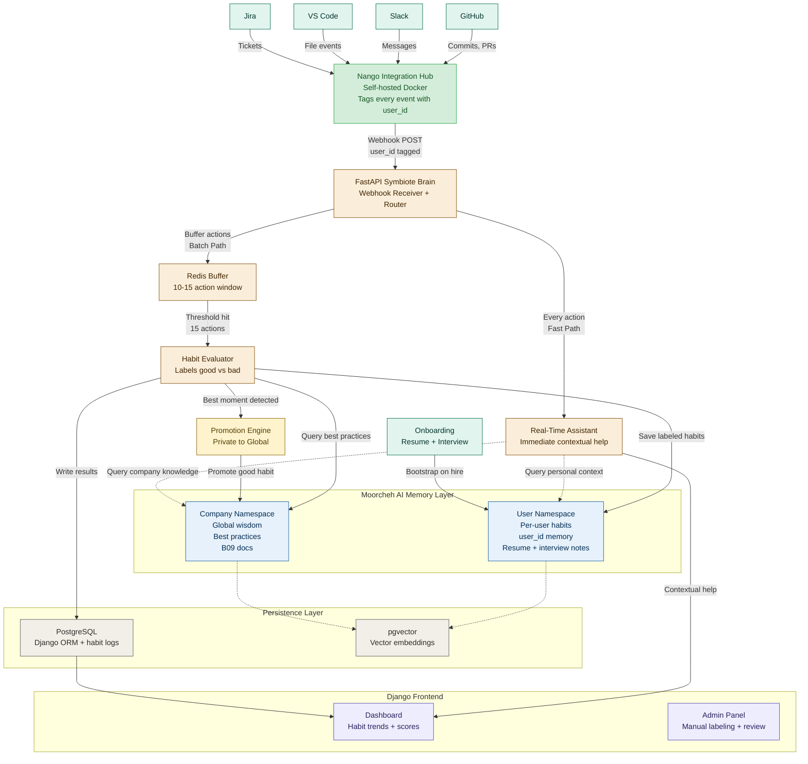
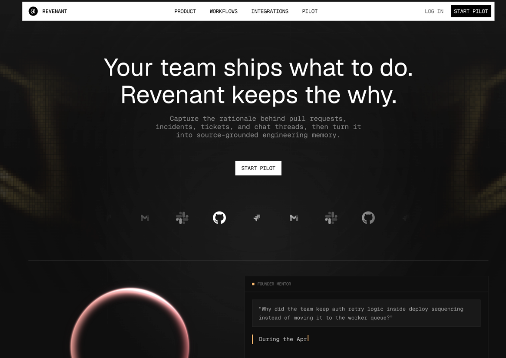
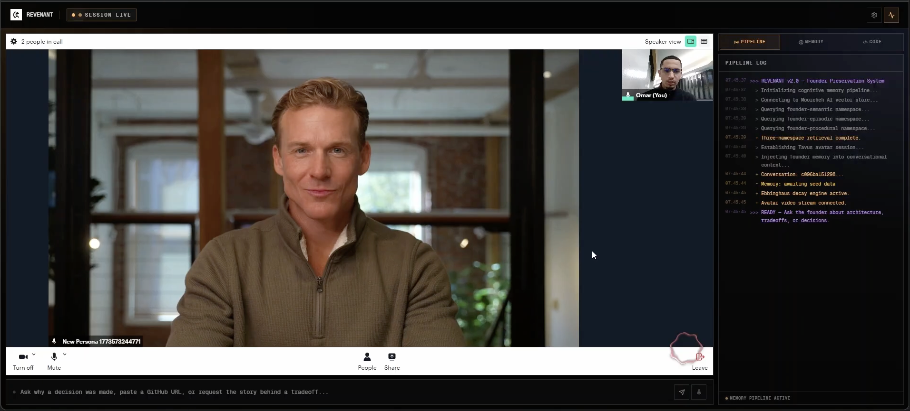

  

<h1 align="center">Omniate</h1>

  <strong>The AI Symbiote for Engineering Teams</strong>

  Omniate turns day-to-day engineering activity into real-time coaching, personal memory, and company-wide best practices.

  <a href="#overview">Overview</a> &nbsp;&bull;&nbsp;
  <a href="#architecture">Architecture</a> &nbsp;&bull;&nbsp;
  <a href="#system-flow">System Flow</a> &nbsp;&bull;&nbsp;
  <a href="#memory-model">Memory Model</a> &nbsp;&bull;&nbsp;
  <a href="#components">Components</a> &nbsp;&bull;&nbsp;
  <a href="#screenshots">Screenshots</a>

---

## Overview

> This README describes the target system architecture for Omniate and should be treated as the source of truth for the platform shape.

Omniate is an engineering habit intelligence system built around two parallel loops:

- a fast path that gives immediate contextual help while work is happening
- a batch path that evaluates behavior over short windows, labels habits, and promotes strong patterns into shared company memory

Activity enters through Nango from GitHub, Slack, VS Code, and Jira. Every event is tagged with a `user_id`, routed by the FastAPI Symbiote Brain, and then sent either to a real-time assistant or to a Redis buffer for habit evaluation. The result is a system that helps individual engineers in the moment while continuously building durable organizational knowledge.

---

## Architecture

---

## System Flow

### 1. Ingestion

Nango normalizes events from the connected tools and forwards them to the FastAPI Symbiote Brain. Every payload is tagged with a `user_id`, which keeps the rest of the system scoped correctly from the moment the event arrives.

### 2. Fast Path

The real-time assistant handles immediate support for each action. It looks up:

- personal context from the user namespace
- company standards from the company namespace

This path is meant for low-latency coaching while an engineer is still in the middle of the task.

### 3. Batch Path

The same events are buffered in Redis in 10-15 action windows. Once the threshold is met, the habit evaluator labels the batch, stores the results, and updates the engineer's private memory.

### 4. Promotion

If the evaluator detects a particularly strong positive pattern, the promotion engine upgrades that moment from private user memory into the shared company namespace so it becomes reusable institutional knowledge.

### 5. Presentation

The Django frontend exposes the results through:

- a dashboard for habit trends and scores
- an admin panel for review, manual labeling, and operational oversight

---

## Memory Model

Omniate keeps two operational memory scopes in Moorcheh:

| Namespace | Purpose | Examples |
|:----------|:--------|:---------|
| **Company Namespace** | Shared engineering wisdom that should be reusable across the org | best practices, playbooks, B09 docs, promoted habits |
| **User Namespace** | Per-engineer context and habit history | onboarding notes, labeled actions, resume context, interview notes |

Onboarding is part of the memory pipeline, not a separate side process. Resume and interview context seed the user namespace on hire so the system starts with useful context instead of an empty profile.

---

## Components

| Layer | Responsibility |
|:------|:---------------|
| **Nango** | Collects tool activity and forwards normalized events with `user_id` tags |
| **FastAPI Symbiote Brain** | Receives webhooks, routes actions, and coordinates downstream processing |
| **Real-Time Assistant** | Uses user and company memory for immediate contextual help |
| **Redis Buffer** | Holds short action windows before batch evaluation |
| **Habit Evaluator** | Labels actions, writes habit outcomes, and identifies promotable moments |
| **Promotion Engine** | Pushes exceptional individual habits into company-wide memory |
| **Moorcheh** | Stores user and company memory layers |
| **PostgreSQL + pgvector** | Persists habit logs, scores, and embedding-backed retrieval data |
| **Django Frontend** | Displays dashboard analytics and admin review workflows |

---

## Screenshots

